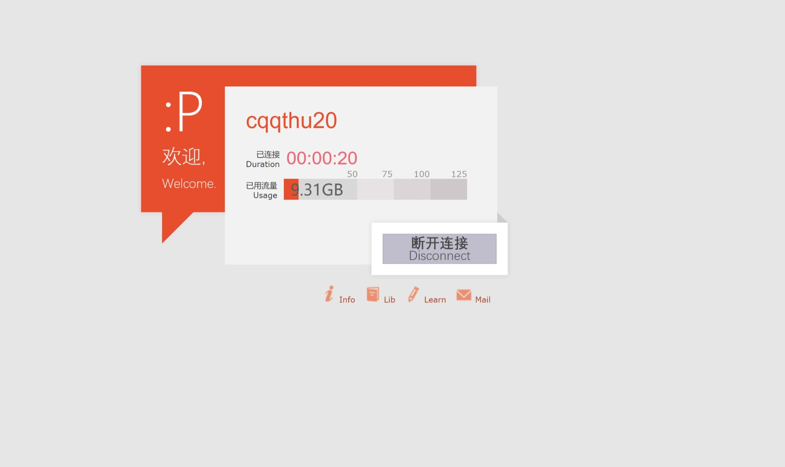
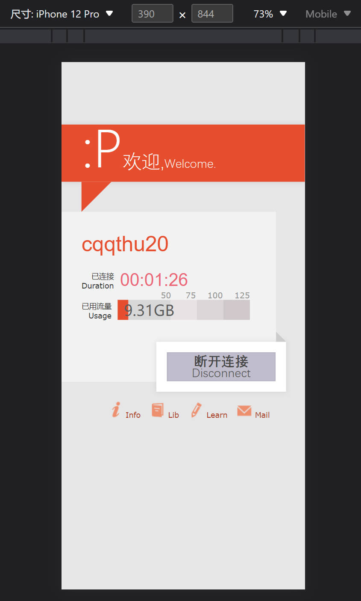

# 《Web 前端技术实训》第一次作业 文档

软件 03 陈启乾 2020012385

## 使用方法

1. 安装依赖: `npm install`
2. 建立服务: `npm run serve`
3. 访问网站: 根据提示，一般或在 <http://localhost:8080> 。

## 效果展示



可以在 <https://github.com/ChenQiqian/campus-net/tree/hw1> 上查看该项目以及文档。

## 实现思路

使用 Vue.js 框架，与 TypeScript 语言完成。

界面整体作为一个名为 Info 的 Component，橙色的部分和白色的信息框分别用一个 `div` 实现。

橙色的部分包括一个大的方形块，和一个三角形的块。方形块内部的字采用 `p` 标签实现，**而不是原网站中的图片实现**。小三角部分使用 border 来实现，两边有颜色两边透明的边界，大小为 0 的 `div` 标签即可实现。

白色的信息框内部从上到下排列：名字，连接时长，已经使用的流量。

1. 名字采用 h2，使用了与原站中类似的 css。

2. 连接时长调用一个 ts 函数，在 Vue 组件 `mounted` 的时候开始计时，然后每 0.5s 刷新一次时间，达到每秒自动的更新时间。

3. 已经使用的流量通过一个 Vue 的 Props 实现动态绑定（为后面留出接口），但在这里数据是写死在 ts 之中的。这里会动态根据流量使用的多少来修改橙色已经使用部分的长度，这里是使用了 Vue 的计算属性功能自动绑定。色块在这里是使用 css 的长度和定位来实现，**而不是原网站中的图片实现。**

断开连接使用一个 `div` 实现，内部有一个按钮（“断开连接”），css 会根据状态（`:hover`, `:active` ）选择不同的背景颜色，**而不是原网站中的图片实现**。点击会有对话框提示： `您已经断开连接`，这里是使用了 Vue 的事件绑定，为后续开发留好接口。

最后还有四个链接。这里采用 Vue.js 的列表渲染功能，将数据输入 ts 代码，即可以自动渲染出所有的链接。

本页面使用的字体：

1. 等线（Dengxian）
2. 微软雅黑（Microsoft YaHei）
3. Verdana
4. Helvetica

理论上，如果是 Windows 电脑/MacOS 电脑且安装了 Office 套件，这些字体应该都存在。

## 一些遇到的问题和解决方法

### 元素定位以及居中的实现

原来的网页上有较为精(xie)确(si)的元素定位，我们在这里沿袭。但是这里较难实现的是居中的效果。因为两个主要的部分都是以 absolute 方式定位，从而不占用正常文档流。应对这个问题的话，我们对外层的 info 指定了宽度和高度: 例如指定 `max-width=768px; width=100%` 让空 div 块可以撑满空间并自动缩小。这样再搭配上 `margin:auto` 即可实现居中功能。

### 移动端适配

面对移动端适配，为了尽可能地少改动代码；我们采用了在检测到屏幕变窄的时候采用另外的 css，并使用 `!important` 覆盖。

具体来说：

```css
@media (max-width: 600px) {
  #info-block {
    position: relative !important;
    left: 0px;
    top: 48px;
  }
  #greeting {
    position: relative !important;
    height: auto !important;
  }
  #welcome-text p {
    display: inline-block;
  }
}
```

当宽度小于 600px 的时候，我们就使用以上的代码，将各个元素均插入回到文档流中，这样就可以正常换行，元素不会被遮挡。

除此之外，文档中还大量使用了 `flex` 盒子，配合上 `flex-wrap` 的选项，可以实现较好的移动端适配效果（以高度换宽度）。

除此之外，针对不能换行的部分（例如流量条），我们采用 `max-width:???px;width: 100%`，内部采用相对宽度，从而保证能够在整体宽度变窄的情况下尽可能保证完整的显示效果。

在 chrome 调试器中的效果如下：

