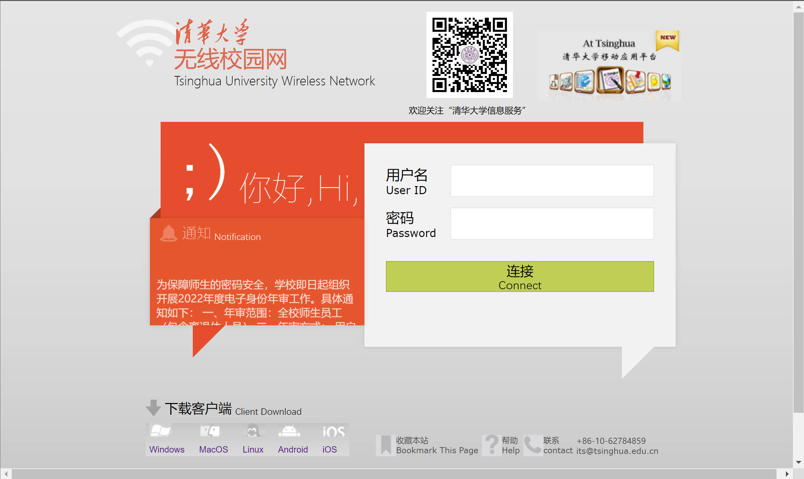
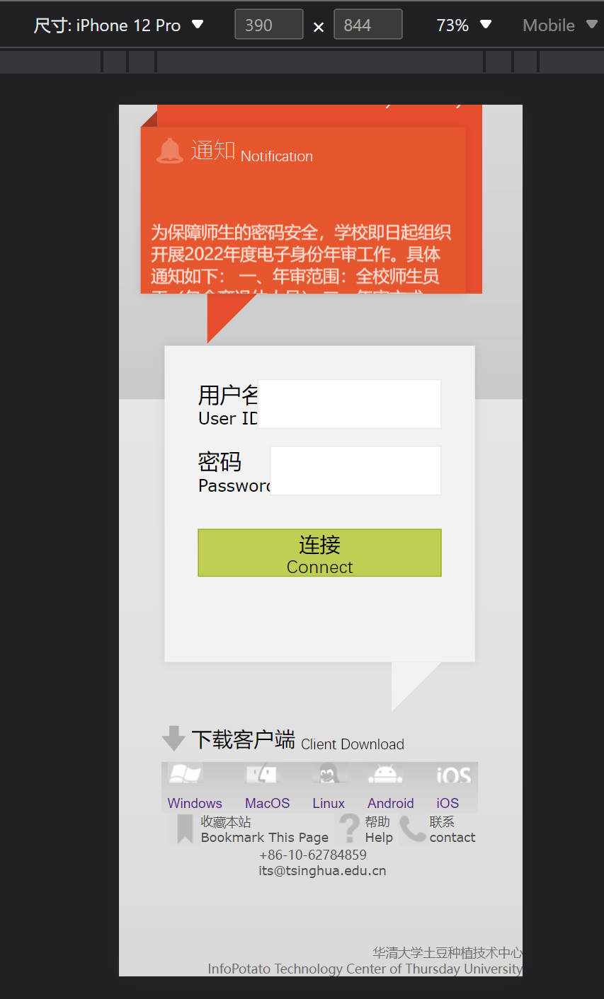
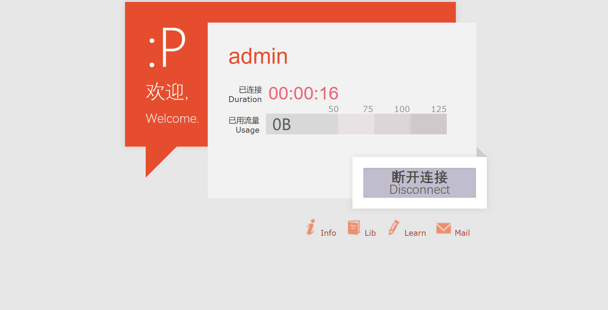

# 《Web 前端技术实训》第二次作业 文档

软件 03 陈启乾 2020012385

[TOC]

可以在 <https://github.com/ChenQiqian/campus-net/tree/hw2/> 查看本项目及文档。

## 效果及功能 GIF 演示

见 [展示GIF](doc/show.gif)，分别展示了：

1. 最初创建用户，信息页流量为 0 ，退出登录回到登录页。
2. 使用错误的密码无法登录。
3. 使用正确的密码登录，观察到第一次退出后的流量改变，退出登录后回到登录页。
4. 使用正确的密码登录，观察到第二次退出后的流量改变，退出登录后回到登录页。

## 使用方法

> 本次作业已部署于 <http://net.cqqqwq.com>

### 本地部署

1. 安装依赖：

```
npm install
pip install -r requirements.txt
```

2. 编译静态文件

```
npm run build
```

3. 设置 Flask + Waitress 服务

```
python3 main.py
```

正常情况下，Waitress 服务应该使用 5000 端口。

### Docker 部署

构建镜像：

```bash
docker build campus-net .
```

运行容器：

```bash
docker run -dp 5000:5000 campus-net 
```


## 实现说明

前端使用 Vue.js + TypeScript 实现，后端使用 Flask 实现。

### 登录界面

位于 `app.vue` 中



页面分为三部分：

1. 顶部的信息栏
2. 中间的登录窗口
3. 底部的信息栏

#### 顶部的信息栏

顶部的信息栏分为三部分，使用 flex 盒子实现，并且有 flex-wrap 选项。

1. 左侧的题目：这部分将原来的图片切分，制作了 svg 格式的无线网图标，并从官方宣传资料中节选出了 svg 格式的清华大学标题文字。标题文字底下的部分也从图片变为了文字，组合成为一个 div 块。

2. 中间的二维码：采用原来的照片。底下配文。

3. 右侧的移动应用平台图片：采用原来的图片。

#### 中间的登录块

1. 问候块：使用了方正兰亭超细黑作为字体，和原来界面上的字体高度吻合，因而不需要在 “；）你好，Hi” 处引入图片。
2. 通知块：铃铛的图标和“通知 Notification”同样矢量化，使用了方正兰亭超细黑和等线字体。
3. 滚动的通知：原来这里使用了 marquee 块，但是这个标签已经被标记为过时，因此使用了 css 的 animation 属性来实现该效果（具体为 ` animation: marquee 10s linear infinite;`）
4. 登陆块：大量使用了 flex 盒子排布元素，并且借鉴了原网站中 input 元素的阴影实现。其中两个输入块都采用了 `v-model` 进行数据绑定。
5. 连接按钮：点击连接之后向后端发送登陆请求（`/api/login`），登陆请求会获取一个 `userid` 作为 cookie 存放在浏览器中。

#### 底部的信息栏

底部的信息栏分为左右两个部分：

1. 左侧的下载客户端：这里同样将图片矢量化，并且引入类似的字体。底下的五个链接也是采用 Vue 的列表渲染语法，将图片、链接、文字预先导入 TS 脚本之后进行列表渲染。
2. 右侧的书签等：仿照原网页进行制作。在这里使用了 flex-box 。

#### 移动端的适配

采用了在检测到屏幕宽度变窄时，使用 `!important` 语句强制更改 css 样式。主要是将原先强制定位（absolute）的元素变为相对定位（relative）返回文档流，这样就可以自由的换行。

除此之外，还大量使用了 `max-width:???px;width:100%` 的自动调整宽度的 css 于密码框、登陆框等等。

如：

```css
@media (max-width: 800px) {
  #copyright {
    right: unset !important;
  }
}
@media (max-width: 600px) {
  #info-block {
    position: relative !important;
    left: 0px;
    top: 48px;
  }
  #greeting {
    position: relative !important;
    height: auto !important;
  }
  #welcome-text p {
    display: inline-block;
  }
}
```

基本可以适配移动端。



### 成功界面



在第一次作业中已经叙述过：

> 使用 Vue.js 框架，与 TypeScript 语言完成。
> 
> 界面整体作为一个名为 Info 的 Component，橙色的部分和白色的信息框分别用一个 `div` 实现。
> 
> 橙色的部分包括一个大的方形块，和一个三角形的块。方形块内部的字采用 `p` 标签实现，**而不是原网站中的图片实现**。小三角部分使用 border 来实现，两边有颜色两边透明的边界，大小为 0 的 `div` 标签即可实现。
> 
> 白色的信息框内部从上到下排列：名字，连接时长，已经使用的流量。
> 
> 1. 名字采用 h2，使用了与原站中类似的 css。
> 
> 2. 连接时长调用一个 ts 函数，在 Vue 组件 `mounted` 的时候开始计时，然后每 0.5s 刷新一次时间，达到每秒自动的更新时间。
> 
> 3. 已经使用的流量通过一个 Vue 的 Props 实现动态绑定（为后面留出接口），但在这里数据是写死在 ts 之中的。这里会动态根据流量使用的多少来修改橙色已经使用部分的长度，这里是使用了 Vue 的计算属性功能自动绑定。色块在这里是使用 css 的长度和定位来实现，**而不是原网站中的图片实现。**
> 
> 断开连接使用一个 `div` 实现，内部有一个按钮（“断开连接”），css 会根据状态（`:hover`, `:active` ）选择不同的背景颜色，**而不是原网站中的图片实现**。点击会有对话框提示： `您已经断开连接`，这里是使用了 Vue 的事件绑定，为后续开发留好接口。
> 
> 最后还有四个链接。这里采用 Vue.js 的列表渲染功能，将数据输入 ts 代码，即可以自动渲染出所有的链接。
> 
> 本页面使用的字体：
> 
> 1. 等线（Dengxian）
> 2. 微软雅黑（Microsoft YaHei）
> 3. Verdana
> 4. Helvetica
> 
> 理论上，如果是 Windows 电脑/MacOS 电脑且安装了 Office 套件，这些字体应该都存在。

这次作业中不同的处理：

1. 在加载页面的时候，在 Info 组件的 `mount()` 函数中会向后端请求用户名（`/api/get_username`）和 获取已用的流量（`/api/usage_volume`，`GET`），并且显示到页面的对应位置。

2. 点击断开连接的时：
    1. 弹出对话框（“您已退出登录”）
    2. 随机一个 0 至 10^9 之间的整数，作为新增的 Byte 数，调用修改已用的流量（`/api/usage_volume`, `POST`）。
    3. 将浏览器中保存的 cookie 清空，跳转到登录界面。

### 后端

后端使用 Flask 作为实现，并在外面包装了一层 Waitress 作为 server 。

使用 python 的 sqlite3 库构建数据库存储用户数据（文件名默认为 `users_data.db`）。数据库关系如下：

| username | password | usage_volume | userid |
| :------: | :------: | :----------: | :----: |
|   str    |   str    |    number    |  str   |

实现了以下的接口：

1. `/api/login` ，使用 `POST` 方法，在 `json` 表单中传递用户名和密码。会首先核查用户名在数据库中是否存在，不存在的话创建用户；存在的话核查密码，与数据库中现有密码不一致的话就返回 401 错误，否则就随机创建 `userid`` 字符串并且返回给用户作为 cookie 。

2. `/api/get_username`，使用 GET 方法；浏览器读取 cookie 中的 `userid`，并且根据 `userid` 返回 `username`

3. `/api/usage_volume`：
    1. 使用 `GET` 方法时，作为获取使用流量的接口。使用 `userid` 鉴权，随后返回使用的流量。
    2. 使用 `POST` 方法时，作为修改使用流量的接口。使用 `userid` 鉴权，随后在数据库中修改使用的流量。

两个网页同样使用 Flask 进行后端搭建。

1. `/`：登录界面。如果本地有正确的 cookie 会被重定向到 `succeed`。
2. `/succeed`：显示连接信息的界面。如果本地没有 cookie，会被重定向到 `/` 。为了防止退出登录后回退等行为，在返回的时候，会加入一个 `no-cache` 的缓存策略。
    1. 注：这里的连接时长是以打开本次页面为开始计时，没有存储到后端，也没有存储到 cookie 。